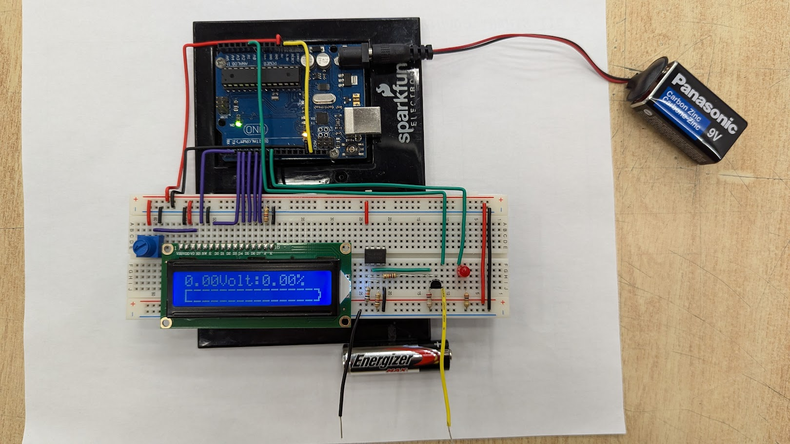

# Arduino Battery Voltage Tester with LCD Display

## 📌 Project Overview
This project is an **Arduino-based battery voltage tester** that measures the voltage of a battery and displays the result in real time on a **16×2 LCD screen**. It demonstrates fundamental embedded systems concepts such as analog voltage measurement, voltage dividers, and LCD interfacing.

The system can be used to test common batteries (AA, AAA, etc.) safely within the Arduino’s input voltage limits.

---

## 🔧 Hardware Components
- Arduino Uno  
- 16×2 LCD Display  
- Breadboard  
- Resistors (voltage divider)  
- Potentiometer (LCD contrast)  
- LED indicator  
- 9V battery (Arduino power supply)  
- AA battery (battery under test)  
- Jumper wires  

---

## 📸 Built Circuit
Below is the physical implementation of the circuit used in this project:

> **Note:** The battery under test is connected through a voltage divider to protect the Arduino’s analog input.

---

## ⚡ How It Works
1. The battery voltage is passed through a **voltage divider** to ensure it stays below 5V.
2. The Arduino reads the scaled voltage using `analogRead()`.
3. The raw ADC value is converted into a real voltage.
4. The voltage is mapped to an estimated **percentage charge**.
5. The LCD displays:
   - Battery voltage
   - Charge percentage
   - A visual bar indicator

---

## 🧠 Code Overview
- Uses the `LiquidCrystal` library for LCD control
- Converts ADC values using Arduino’s 10-bit resolution
- Simple math-based voltage calibration
- Dynamic LCD updates for real-time feedback

---

## 🧪 Calibration Notes
- Voltage divider resistor values must match those used in the code
- ADC reference voltage is assumed to be **5.0V**
- Battery percentage is an **approximation**, intended for learning purposes

---

## 🚀 Possible Improvements
- Automatic battery type detection
- OLED display support
- EEPROM-based calibration storage
- Battery health and discharge curve tracking
- Over-voltage protection circuitry

---

## 🎓 Educational Value
This project is ideal for:
- Learning Arduino analog inputs
- Understanding voltage dividers
- Practicing LCD interfacing
- Introductory embedded systems projects

---

## 📄 License
This project is open-source and available under the **MIT License**.

